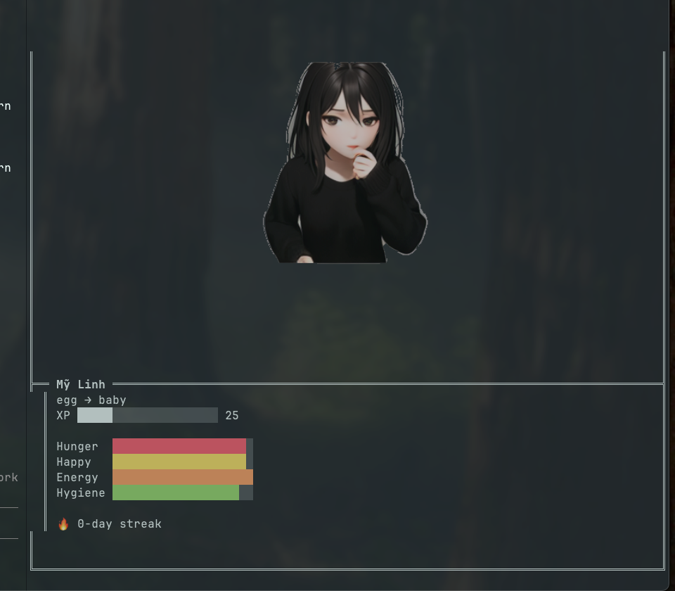

<div align="center">

# Oh My Kira

**Your coding companion, alive in the terminal.**

A real-time animated sprite renderer for [Claude Buddy](https://github.com/anthropics/claude-code) that brings your AI coding companion to life — right next to your code.

[](https://nodejs.org)
[](https://ghostty.org)
[](LICENSE)

<br />


<br />

*Kira reacts to your coding session in real time — mood, stats, speech bubbles, and all.*

</div>

---

## What is this?

Oh My Kira renders an **animated companion** in a terminal pane while you code with Claude. It watches the buddy state file and displays:

- **Animated sprites** that react to mood and activity
- **Live stat bars** — hunger, happiness, energy, hygiene
- **XP & evolution** — level up your buddy over time
- **Speech bubbles** — idle thoughts and reactions
- **Streak tracking** — consecutive coding days

```
+------------------------------------------+
|        "hmm, interesting approach..."     |
|                                           |
|            [animated sprite]              |
|                                           |
+== My Linh ===============================+
| egg -> baby                               |
| XP ████░░░░░░░░░░░░░░░░ 25               |
|                                           |
| Hunger  ████████████████████              |
| Happy   ███████████████████░              |
| Energy  ███████████████████░              |
| Hygiene ███████████████████░              |
|                                           |
| 🔥 8-day streak                           |
+------------------------------------------+
```

## Requirements

| Requirement | Details |
|------------|---------|
| **Node.js** | >= 18 |
| **Terminal** | [Ghostty](https://ghostty.org) or [Kitty](https://sw.kovidgoyal.net/kitty/) (Kitty graphics protocol) |
| **Claude Code** | With the [claude-buddy](https://github.com/anthropics/claude-code) plugin |

## Quick Start

```bash
# Clone & install
git clone https://github.com/lukebaze/oh-my-kira.git
cd oh-my-kira
npm install
npm link

# Run
oh-my-kira --watch ~/.claude/buddy/state.json
```

### Launch from Claude Code

```
/buddies launch
```

> Auto-splits your Ghostty terminal and starts the renderer in a side pane.

### CLI Options

| Flag | Description | Default |
|------|-------------|---------|
| `--watch <path>` | Buddy state JSON file | `~/.claude/buddy/state.json` |
| `--art-packs <dir>` | Art packs directory | `~/.claude/buddy/art-packs/` |

## Art Packs

Two packs are bundled out of the box:

| Pack | Style | Preview |
|------|-------|---------|
| **kira** | Anime companion |  |
| **wpenguin** | Pixel art penguin | *coming soon* |

### Create Your Own

```
my-pack/
  pack.json
  spritesheets/
    idle.png
    typing.png
    ...
```

<details>
<summary><strong>pack.json reference</strong></summary>

```json
{
  "name": "My Pack",
  "author": "you",
  "version": "1.0.0",
  "description": "A custom art pack",
  "format": "spritesheet-grid",
  "frame_size": { "width": 768, "height": 448 },
  "grid_cols": 4,
  "scale": 1,
  "state_map": {
    "idle":    { "sheet": "idle.png",   "frames": 10, "interval_ms": 100 },
    "working": { "sheet": "typing.png", "frames": 8,  "interval_ms": 120 }
  }
}
```

| Field | Description |
|-------|-------------|
| `format` | `spritesheet-grid` (grid) or `spritesheet` (horizontal strip) |
| `frame_size` | Pixel dimensions of each frame |
| `grid_cols` | Columns in the spritesheet grid |
| `scale` | Pre-scale factor (1 = original) |
| `state_map` | Maps states to sheets, frame counts, and animation speed |

</details>

### Visual States

Your buddy automatically switches between states based on what's happening:

| State | Trigger |
|-------|---------|
| `idle` | Default — nothing happening |
| `working` | Active coding session |
| `happy` / `very_happy` | Happiness > 80% / > 95% |
| `energy_low` | Energy < 30% |
| `hunger_low` | Hunger < 30% |
| `hygiene_low` | Hygiene < 30% |
| `error` | Test failure or error |
| `critical` | Multiple stats critically low |
| `session_start` / `session_end` | Session lifecycle events |

## Architecture

```
bin/
  oh-my-kira.js          # CLI entry point
lib/
  renderer.js            # Render loop & animation orchestrator
  sprite-loader.js       # Spritesheet slicing & background removal
  kitty.js               # Kitty graphics protocol (escape sequences)
  layout.js              # Responsive terminal layout calculator
  watcher.js             # File watcher (chokidar)
  state-resolver.js      # Buddy state → visual state mapping
  speech-bubble.js       # Speech bubble rendering
  idle-thoughts.js       # Random idle thought messages
assets/
  kira/                  # Bundled: anime companion
  wpenguin/              # Bundled: pixel penguin
```

## Development

```bash
git clone https://github.com/lukebaze/oh-my-kira.git
cd oh-my-kira
npm install
npm test
```

## License

MIT
