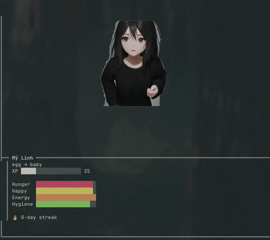

# Oh My Kira

Terminal renderer for [Claude Buddy](https://github.com/anthropics/claude-code) companions. Displays an animated sprite with live stats in your terminal using the [Kitty graphics protocol](https://sw.kovidgoyal.net/kitty/graphics-protocol/).


<p align="center">
  
</p>

## Requirements

- **Node.js** >= 18
- **Terminal** with Kitty graphics protocol support (e.g., [Ghostty](https://ghostty.org), [Kitty](https://sw.kovidgoyal.net/kitty/))
- **Claude Code** with the [claude-buddy plugin](https://github.com/anthropics/claude-code) installed

## Installation

```bash
git clone https://github.com/lukebaze/oh-my-kira.git
cd oh-my-kira
npm install
npm link
```

This makes `oh-my-kira` available globally in your terminal.

## Usage

### Basic

```bash
oh-my-kira --watch ~/.claude/buddy/state.json
```

### Options

| Flag | Description | Default |
|------|-------------|---------|
| `--watch <path>` | Path to buddy state JSON file | `~/.claude/buddy/state.json` |
| `--art-packs <dir>` | Directory containing art packs | `~/.claude/buddy/art-packs/` |

### Launch from Claude Code

If you have the claude-buddy plugin installed, run:

```
/buddies launch
```

This auto-splits your Ghostty terminal and starts the renderer in the right pane.

### Manual split (any terminal)

Open a second pane/tab and run:

```bash
oh-my-kira --watch ~/.claude/buddy/state.json
```

## How It Works

The renderer watches `state.json` for changes (written by the claude-buddy plugin during coding sessions) and displays:

- Animated sprite based on buddy mood/state
- Live stat bars (hunger, happiness, energy, hygiene)
- XP progress and evolution stage
- Speech bubbles with thoughts

```
+------------------------------------------+
|          (speech bubble)                  |
|                                           |
|            [animated sprite]              |
|                                           |
+== Buddy Name ============================+
| egg -> baby                               |
| XP ████░░░░░░░░░░░░░░░░ 25               |
|                                           |
| Hunger  ████████████████████              |
| Happy   ███████████████████░              |
| Energy  ███████████████████░              |
| Hygiene ███████████████████░              |
+------------------------------------------+
```

## Art Packs

Art packs live in `~/.claude/buddy/art-packs/`. Two are bundled:

- **kira** - Anime girl companion
- **wpenguin** - Pixel art penguin

### Art Pack Structure

```
my-pack/
  pack.json
  spritesheets/
    idle.png
    typing.png
    ...
```

### pack.json

```json
{
  "name": "My Pack",
  "author": "you",
  "version": "1.0.0",
  "description": "Description of the art pack",
  "format": "spritesheet-grid",
  "frame_size": { "width": 768, "height": 448 },
  "grid_cols": 4,
  "scale": 1,
  "state_map": {
    "idle":    { "sheet": "idle.png",   "frames": 10, "interval_ms": 100 },
    "working": { "sheet": "typing.png", "frames": 8,  "interval_ms": 120 }
  }
}
```

| Field | Description |
|-------|-------------|
| `format` | `spritesheet-grid` (grid layout) or `spritesheet` (horizontal strip) |
| `frame_size` | Width and height of each frame in pixels |
| `grid_cols` | Number of columns in the spritesheet grid |
| `scale` | Pre-scale factor applied to frames (1 = original size) |
| `state_map` | Maps visual states to spritesheets, frame counts, and animation speed |

### Visual States

| State | Triggered when |
|-------|---------------|
| `idle` | Default state |
| `happy` | Happiness > 80% |
| `very_happy` | Happiness > 95% |
| `working` | During active coding |
| `energy_low` | Energy < 30% |
| `hunger_low` | Hunger < 30% |
| `hygiene_low` | Hygiene < 30% |
| `error` | Test failure or error |
| `critical` | Multiple stats critically low |
| `session_start` | Coding session begins |
| `session_end` | Coding session ends |

## Development

```bash
git clone https://github.com/lukebaze/oh-my-kira.git
cd oh-my-kira
npm install
npm test
```

### Project Structure

```
bin/
  oh-my-kira.js              # CLI entry point
lib/
  renderer.js                # Main render loop and animation
  sprite-loader.js           # Spritesheet slicing and background removal
  kitty.js                   # Kitty graphics protocol escape sequences
  layout.js                  # Responsive terminal layout calculator
  watcher.js                 # File watcher (chokidar)
  state-resolver.js          # Maps buddy state to visual states
  speech-bubble.js           # Speech bubble rendering
  idle-thoughts.js           # Random idle thought messages
assets/
  kira/                      # Bundled art pack
  wpenguin/                  # Bundled art pack
```

## License

MIT
